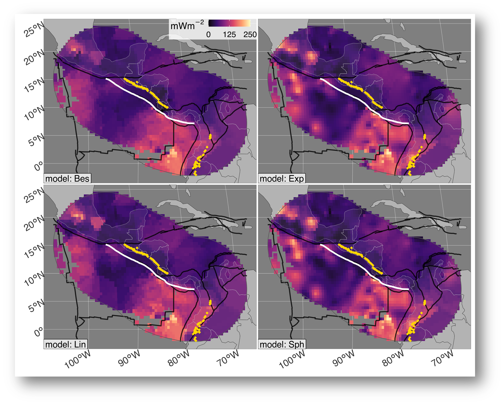

***Figure:*** *Similarity and Kriging interpolations for Vanuatu. While (a) Similarity predicts more-or-less uniformly-high surface heat flow within the region defined by many microplates, (b) excellent observational coverage allows Kriging to distinguish the most northern microplate from the New Hebrides Plate (NHP), Balmoral Reef (BR), and Conway Reef (CWR) microplates to the S. The geologic proxy datasets used to construct Similarity interpolations are apparently too coarse to resolve microplate-size features in this case. Segment boundary (bold white line) and volcanoes (gold diamonds) defined by Syracuse & Abers ([2006](https://agupubs.onlinelibrary.wiley.com/doi/abs/10.1029/2005gc001045)). Similarity interpolation from Lucazeau ([2019](https://agupubs.onlinelibrary.wiley.com/doi/full/10.1029/2019GC008389)). Plate boundaries (bold black lines) defined by Lawver et al. ([2018](https://repositories.lib.utexas.edu/handle/2152/65415)).*

# Kerswell & Kohn (2023; G3)

This work investigates methods for interpolating surface heat flow data near subduction zones. We applied two different interpolations methods, *Similarity* and *Kriging* to the [ThermoGlobe](http://heatflow.org) dataset (Jennings et al., 2021), and compared the results. Interpolations show that surface heat flow is complex and often discontinuous along strike near subduction zones, thus implying that the deep thermal structure and/or near-surface modifications are also discontinuous.

The [manuscript](https://buchanankerswell.com/assets/dissertation/dissertation-ebook.html#chpt3) is in preparation for *Geochemistry, Geophysics, Geosystems*. You can find the preprint [here](https://buchanankerswell.com/assets/pdf/kerswell-kohn-backarc-g3-2023.pdf).

## Repository

This repository provides all materials for the manuscript *A Comparison of Heat Flow Interpolations Near Subduction Zones* (Kerswell & Kohn 2023; G3).

This repository includes:

- All datasets required to compile the study
- R scripts to reproduce all results and figures
- A Makefile to compile the study
- The complete manuscript written in Rmarkdown

This repository is self-contained but requires the following software (all open-source).

## Prerequisite software

### R

This study is written in R. Follow the instructions at [R's homepage](https://www.r-project.org) to download and install the latest release of R on your machine.

### GDAL, GEOS, and PROJ

Geographic operations require the geographic libraries [gdal](https://gdal.org), [geos](https://trac.osgeo.org/geos), and [proj](https://proj.org). On a Mac, the easiest way to get gdal, geos, and proj is to use Homebrew. Follow the instructions at [Hombrew's homepage](https://brew.sh) to download and install Homebrew on your machine.

Once Homebrew is installed, the following will install the latest gdal, geos, and proj libraries together:

```
brew install pkg-config
brew install gdal
```

### sf

The trickiest R package to install is [sf](https://r-spatial.github.io/sf/), since it needs to be compiled from source and depends on gdal, geos, and proj. Installation instructions for mac are found [here](https://github.com/r-spatial/sf/issues/1536#issuecomment-727342736). For all other systems please see [sf's webpage](https://r-spatial.github.io/sf/).

## Running the study

```
# Clone this repository
git clone https://github.com/buchanankerswell/kerswell_kohn_backarc.git

# Change into the directory
cd kerswell_kohn_backarc

# Use Makefile to compile
make
```

This will check for required R packages and try to install missing packages automatically.

If all packages are found and available it will proceed to run the study with some initial prompts from the user. The study takes about ??? to run on my MacBook Air (M1 8GB, 2020) setting a maximum of 30 optimization iterations that use the [NLOPT_LN_SBPLX](https://nlopt.readthedocs.io/en/latest/NLopt_Algorithms/)  leave-one-out cross validation for computing the cost function and 8 cores computing in parallel. The study takes about ??? minutes to with 1 optimization step (i.e. Kriging with an initial guess without optimization).

## Coauthors

 - [Matthew Kohn](https://www.google.com/url?sa=t&rct=j&q=&esrc=s&source=web&cd=&cad=rja&uact=8&ved=2ahUKEwj8yqqTw8T5AhWSADQIHaYXAfQQFnoECA4QAQ&url=https%3A%2F%2Fwww.boisestate.edu%2Fearth%2Fstaff-members%2Fmatthew-j-kohn%2F&usg=AOvVaw3-lM9gvqmVRHG-WhSRFOdu) (Boise State University)

## Acknowledgement

We gratefully acknowledge high-performance computing support of the Borah compute cluster (DOI: [10.18122/oit/3/boisestate](10.18122/oit/3/boisestate)) provided by Boise State University’s Research Computing Department. We thank D. Hasterok for providing the NGHF references and guidance on citing. This work was supported by the National Science Foundation grant OISE 1545903 to M. Kohn, S. Penniston-Dorland, and M. Feineman.

## Open Research

All data, code, and relevant information for reproducing this work can be found at [https://github.com/buchanankerswell/kerswell_et_al_backarc](https://github.com/buchanankerswell/kerswell_et_al_backarc), and at [https://doi.org/10.17605/OSF.IO/CA6ZU](https://doi.org/10.17605/OSF.IO/CA6ZU), the official Open Science Framework data repository ([Kerswell et al., 2023](https://doi.org/10.17605/OSF.IO/CA6ZU)). All code is MIT Licensed and free for use and distribution (see license details).

## Abstract

The magnitude and spatial extent of heat fluxing through the Earth's surface depend on the integrated thermal state of Earth's lithosphere (conductive heat loss) plus heat generation (e.g. from seismic cycles and radioactive decay) and heat transfer via advection (e.g. by fluids, melts, and plate motions). Surface heat flow observations are thus critically important for understanding the thermo-mechanical evolution of subduction zones. Yet evaluating regional surface heat flow patterns across tectonic features remains difficult due to sparse observations irregularly-spaced at distances from 10$^{-1}$ to 10$^3$ km. Simple sampling methods (e.g. 1D trench-perpendicular transects across subduction zones) can provide excellent location-specific information but are insufficient for evaluating lateral (along-strike) variability. Robust interpolation methods are therefore required. This study compares two interpolation methods based on fundamentally different principles, *Similarity* and *Kriging*, to (1) investigate the spatial variability of surface heat flow near 13 presently active subduction zone segments and (2) provide insights into the reliability of such methods for subduction zone research. Similarity and Kriging predictions show diverse surface heat flow distributions and profiles among subduction zone segments and broad systematic changes along strike. Median upper-plate surface heat flow varies 25.4 mW/m$^2$ for Similarity and 40 mW/m$^2$ for Kriging within segments, on average, and up to 40.7 mW/m$^2$ for Similarity and up to 85.7 mW/m$^2$ for Kriging among segments. Diverse distributions and profiles within and among subduction zone segments imply spatial heterogeneities in lithospheric thickness, subsurface geodynamics, or near-surface perturbations, and/or undersampling relative to the scale and magnitude of spatial variability. Average accuracy rates of Similarity (28.8 mW/m$^2$) and Kriging (29.6 mW/m$^2$) predictions are comparable among subduction zone segments, implying either method is viable for subduction zone research. Importantly, anomalies and methodological idiosyncrasies identified by comparing Similarity and Kriging can aid in developing more accurate regional surface heat flow interpolations and identifying future survey targets.

# License

MIT License

Copyright (c) 2021 Buchanan Kerswell

Permission is hereby granted, free of charge, to any person obtaining a copy
of this software and associated documentation files (the "Software"), to deal
in the Software without restriction, including without limitation the rights
to use, copy, modify, merge, publish, distribute, sublicense, and/or sell
copies of the Software, and to permit persons to whom the Software is
furnished to do so, subject to the following conditions:

The above copyright notice and this permission notice shall be included in all
copies or substantial portions of the Software.

THE SOFTWARE IS PROVIDED "AS IS", WITHOUT WARRANTY OF ANY KIND, EXPRESS OR
IMPLIED, INCLUDING BUT NOT LIMITED TO THE WARRANTIES OF MERCHANTABILITY,
FITNESS FOR A PARTICULAR PURPOSE AND NONINFRINGEMENT. IN NO EVENT SHALL THE
AUTHORS OR COPYRIGHT HOLDERS BE LIABLE FOR ANY CLAIM, DAMAGES OR OTHER
LIABILITY, WHETHER IN AN ACTION OF CONTRACT, TORT OR OTHERWISE, ARISING FROM,
OUT OF OR IN CONNECTION WITH THE SOFTWARE OR THE USE OR OTHER DEALINGS IN THE
SOFTWARE.
