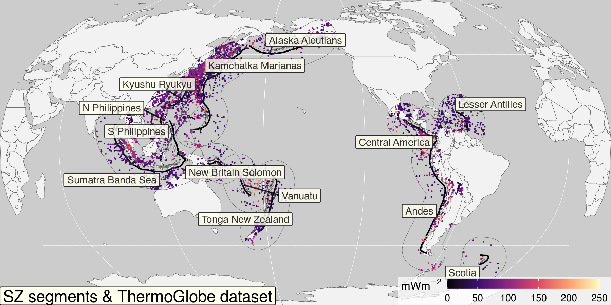
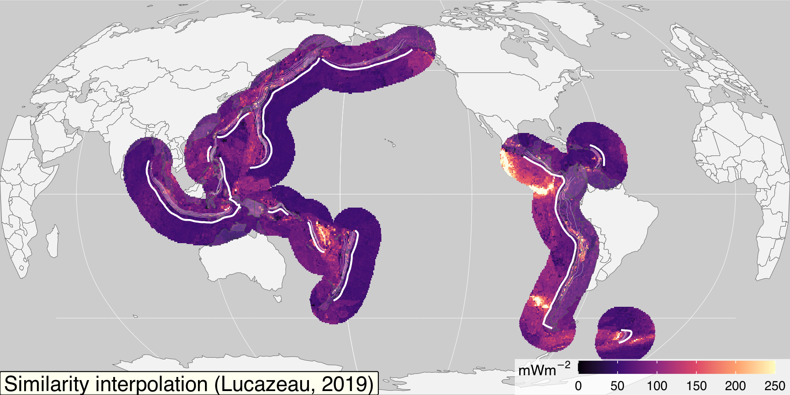

# Currently under revision


## Sample






<!-- # Material for Kerswell & Kohn (2021, G3)

This repository stores all materials for the manuscript *Comparison of heat flow interpolations near subduction zones* and includes:

- The complete datasets
- R scripts to reproduce all results and figures
- The manuscript in R flavoured markdown
- Shell scripts to run the study and build the manuscript

*This repository is self-contained but requires the software below*

## Prerequisite software

### R

This study was coded in `R`. Follow the instructions at [`R`'s homepage](https://www.r-project.org) to download and install the latest release of `R` on your machine.

Additionally, `R` will require the following packages to be installed on your machine:

- `magrittr` for writing human readable code
- `tidyr` for tidying data
- `dplyr` for manipulating data
- `readr` for reading data
- `purrr` instead of for loops
- `ggplot2` for graphics
- `ggsflabel` for labelling geographic plots
- `ggrepel` for better labels
- `patchwork` for assembling plots into compositions
- `cowplot` for plot themes
- `sf` for handling geographic data
- `gstat` for variogram modelling and Kriging
- `rmarkdown` for building the manuscript

Packages can be installed in an `R` session by

```
install.packages('magrittr') # install magrittr
```

The `sf` package requires [`gdal`](https://gdal.org) and [`proj`](https://proj.org) libraries. On Mac, the easiest way to get `gdal` and `proj` is to use `Homebrew`. If your machine does not have `Homebrew`, you can install it by running `/bin/bash -c "$(curl -fsSL https://raw.githubusercontent.com/Homebrew/install/HEAD/install.sh)"` in the terminal. Or follow instructions from [`Hombrew`'s webpage](https://brew.sh).

Once `Homebrew` is installed, use (in terminal)

```
brew install pkg-config
brew install gdal
```

which will install the latest `gdal` and `proj` libraries. Then `sf` can be installed from source by (in a `R` session)

```
install.packages("sf", configure.args = "--with-proj-lib=/usr/local/lib/")
```

For troubleshooting and additional instructions see [`sf`'s webpage](https://r-spatial.github.io/sf/)

### Pandoc and pandoc-crossref

`Pandoc` and `pandoc-crossref` are software for converting markdown documents into many document formats. To build the manuscript, you must have [`pandoc`](https://pandoc.org) and [`pandoc-crossref`](https://github.com/lierdakil/pandoc-crossref) installed on your machine and in your `PATH`.

For Mac, use `Homebrew`

```
brew install pandoc
brew install pandoc-crossref
```

## Running the study

The easiest way to reproduce the study is to run the shell script `run.sh`, which will sequentially run all `R` scripts and print some output to `stdout`, including the paths to figures and data. To achieve this, clone (or download) this repository by `git clone https://github.com/buchanankerswell/kerswell_kohn_backarc.git`. Then, in terminal, run `./run.sh`.

If your machine does not have the `zsh` shell, change the line `#!/bin/zsh` to `#!/bin/bash` (or your preferred shell).

## Building the manuscript

PDF, HTML, and MS Word versions of the manuscript can be built by running (in terminal) `./knit.sh` (requires `pandoc` and `pandoc-corssref`).

# Open Science Framework

This repository can also be found at the official [OSF repository](https://osf.io/ca6zu/).

# Funding

This project was supported by the NSF grant OIA1545903 to M. Kohn, S. Penniston-Dorland, and M. Feineman -->