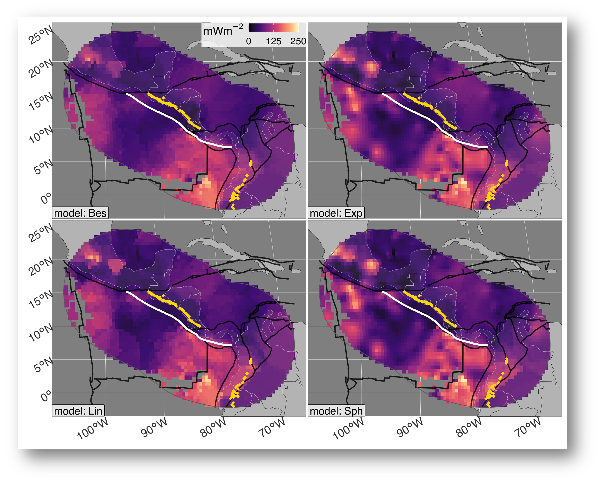

# Kerswell & Kohn (2023; G3)



This repository provides all materials for the manuscript *A Comparison of Heat Flow Interpolations Near Subduction Zones* (Kerswell & Kohn 2023; G3).

This repository includes:

- All datasets required to compile the study
- R scripts to reproduce all results and figures
- A Makefile to compile the study
- The complete manuscript written in Rmarkdown

This repository is self-contained but requires the following software (all open-source).

## Prerequisite software

### R

This study is written in R. Follow the instructions at [R's homepage](https://www.r-project.org) to download and install the latest release of R on your machine.

### GDAL, GEOS, and PROJ

Geographic operations require the geographic libraries [gdal](https://gdal.org), [geos](https://trac.osgeo.org/geos), and [proj](https://proj.org). On Mac, the easiest way to get gdal, geos, and proj is to use Homebrew. If your machine does not have Homebrew, you can install it by running

```
/bin/bash -c "$(curl -fsSL https://raw.githubusercontent.com/Homebrew/install/HEAD/install.sh)"
```

Or follow instructions from [Hombrew's webpage](https://brew.sh).

Once Homebrew is installed, the following will install the latest gdal, geos, and proj libraries together:

```
brew install pkg-config
brew install gdal
```

### sf

The trickiest R package to install is [sf](https://r-spatial.github.io/sf/), since it needs to be compiled from source and depends on gdal, geos, and proj. Installation instructions for mac are found [here](https://github.com/r-spatial/sf/issues/1536#issuecomment-727342736). For all other systems please see [sf's webpage](https://r-spatial.github.io/sf/).

## Running the study

```
# Clone this repository
git clone https://github.com/buchanankerswell/kerswell_kohn_backarc.git

# Change into the directory
cd kerswell_kohn_backarc

# Use Makefile to compile
make
```

This will check for required R packages and try to install missing packages automatically.

If all packages are found and available it will proceed to run the study with some initial prompts from the user. The study takes about ??? to run on my MacBook Air (M1 8GB, 2020) setting a maximum of 30 optimization iterations that use the [NLOPT_LN_SBPLX](https://nlopt.readthedocs.io/en/latest/NLopt_Algorithms/)  leave-one-out cross validation for computing the cost function (as apposed to k=folds \[;where k = proportion of n\]), and 8 cores computing in parallel. The study takes about ??? minutes to with 1 optimization step (initial guess).

# Open Science Framework

This repository can also be found at the official [OSF repository](https://osf.io/ca6zu/).

# Funding

This project was supported by the NSF grant OIA1545903 to M. Kohn, S. Penniston-Dorland, and M. Feineman

# License

MIT License

Copyright (c) 2021 Buchanan Kerswell

Permission is hereby granted, free of charge, to any person obtaining a copy
of this software and associated documentation files (the "Software"), to deal
in the Software without restriction, including without limitation the rights
to use, copy, modify, merge, publish, distribute, sublicense, and/or sell
copies of the Software, and to permit persons to whom the Software is
furnished to do so, subject to the following conditions:

The above copyright notice and this permission notice shall be included in all
copies or substantial portions of the Software.

THE SOFTWARE IS PROVIDED "AS IS", WITHOUT WARRANTY OF ANY KIND, EXPRESS OR
IMPLIED, INCLUDING BUT NOT LIMITED TO THE WARRANTIES OF MERCHANTABILITY,
FITNESS FOR A PARTICULAR PURPOSE AND NONINFRINGEMENT. IN NO EVENT SHALL THE
AUTHORS OR COPYRIGHT HOLDERS BE LIABLE FOR ANY CLAIM, DAMAGES OR OTHER
LIABILITY, WHETHER IN AN ACTION OF CONTRACT, TORT OR OTHERWISE, ARISING FROM,
OUT OF OR IN CONNECTION WITH THE SOFTWARE OR THE USE OR OTHER DEALINGS IN THE
SOFTWARE.
