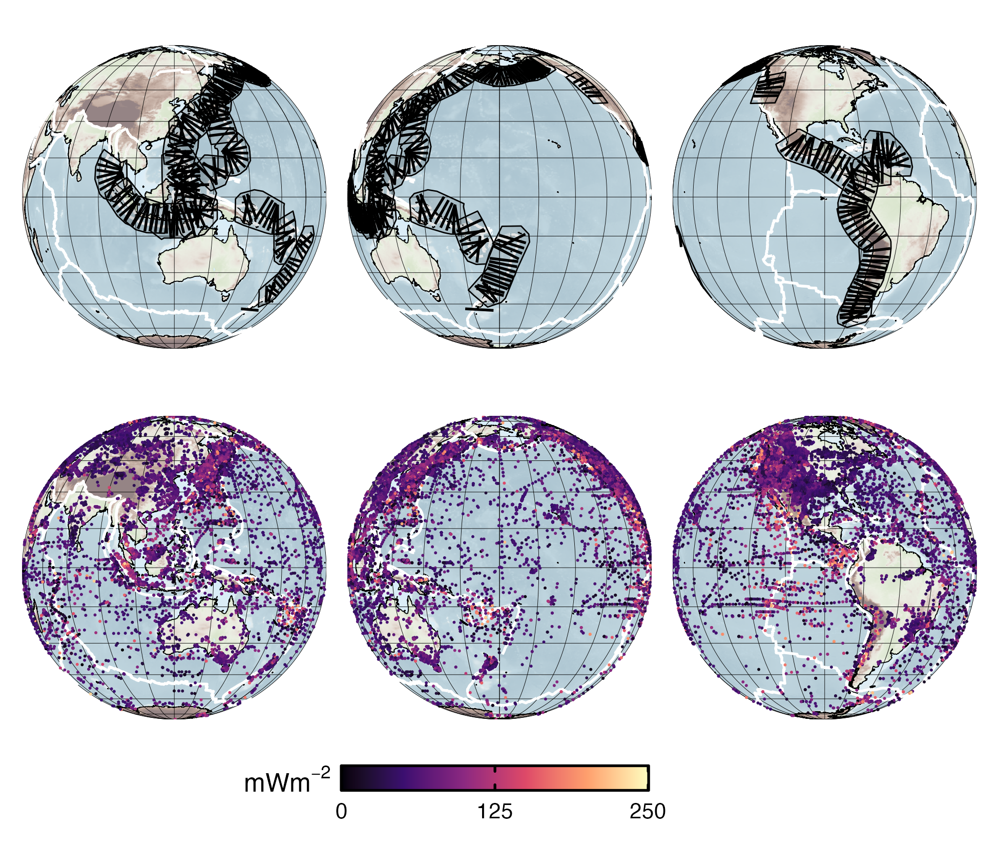

***Figure:*** *Subduction zone segments and global surface heat flow observations. A total of 235 trench-perpendicular transects (top row: bold black lines) and 91,182 raw, unfiltered surface heat flow observations (bottom row) were used for spatial analysis. Convex polygons drawn around 34 sets of transects (top row: shaded areas) defined spatial domains used for sampling and Kriging. Filtered and deduplicated data within these 34 domains (`$N_\mathrm{obs}$` = 60,316 total) show uneven, irregular distributions regionally and globally (Tables S1 and S2). Note the relatively high observation density in N America and around the N Pacific compared to the S Pacific. Plate boundaries (bold white lines) were defined by Coffin et al. ([2018](http://www-udc.ig.utexas.edu/external/plates/data.htm)). Surface heat flow data are from the Global Heat Flow Data Assessment Group et al. ([2024](https://doi.org/10.5880/fidgeo.2024.014)). Transects were defined by Lallemand et al. ([2026](https://submap.fr)).*

# Kerswell & Kohn (2026; submitted)

This work investigated the spatial continuity of surface heat flow near subduction zones. We compared two different interpolations methods, *Similarity* and *Kriging* with surface heat flow data from the Global Heat Flow Data Assessment Group et al. ([2024](https://doi.org/10.5880/fidgeo.2024.014)). Our analysis showed that along-strike surface heat flow continuity near subduction zones is ambiguous or geographically limited, not globally uniform.

## Repository

This repository provides all materials for the manuscript *Along-Strike Heat Flow Near Subduction Zones Is Mostly Ambiguous, Not Globally Uniform* (Kerswell & Kohn 2026; submitted), including all datasets required to compile the study and scripts to reproduce all results and figures.

## Prerequisite software

### R

This study is written in R. Follow the instructions at [R's homepage](https://www.r-project.org) to download and install the latest release of R on your machine.

### GDAL, GEOS, and PROJ

Geographic operations require the geographic libraries [`gdal`](https://gdal.org), [`geos`](https://trac.osgeo.org/geos), and [`proj`](https://proj.org). On a Mac, the easiest way to get `gdal`, `geos`, and `proj` is to use Homebrew. Follow the instructions at [Hombrew's homepage](https://brew.sh) to download and install Homebrew on your machine.

Once Homebrew is installed, the following will install the latest `gdal`, `geos`, and `proj` libraries together:

``` bash
brew install pkg-config
brew install gdal
```

For other systems, see the `gdal`, `geos`, and `proj` websites for installation instructions.

### sf

Spatial datasets are handled using the R package [`sf`](https://r-spatial.github.io/sf/). See [`sf`'s webpage](https://r-spatial.github.io/sf/) for installation instructions.

### Pandoc

Pandoc is a universal document converter used to build a PDF version of the manuscript, which written in Markdown. Pandoc can be downloaded from the [Pandoc homepage](https://pandoc.org). Follow their instructions to install Pandoc on your machine.

## Reproducing the study

``` bash
# Clone this repository
git clone https://github.com/buchanankerswell/kerswell_kohn_heatflow.git

# Change into the directory
cd kerswell_kohn_heatflow

# Get data and reproduce figures
make build
```

## Coauthors

- [Matthew Kohn](https://www.google.com/url?sa=t&rct=j&q=&esrc=s&source=web&cd=&cad=rja&uact=8&ved=2ahUKEwj8yqqTw8T5AhWSADQIHaYXAfQQFnoECA4QAQ&url=https%3A%2F%2Fwww.boisestate.edu%2Fearth%2Fstaff-members%2Fmatthew-j-kohn%2F&usg=AOvVaw3-lM9gvqmVRHG-WhSRFOdu) (Boise State University)

## Acknowledgement

We express our sincere gratitude to the communities, institutions, and research teams who develop and maintain the open-source datasets used in this study. Specifically, we thank the creators of the SubMap tool (Géosciences Montpellier); the University of Texas Institute for Geophysics for the plate boundary compilation; the NOAA National Centers for Environmental Information for the ETOPO 2022 global relief model; the Global Heat Flow Data Assessment Group for maintaining the Global Heat Flow Database; and F. Lucazeau for providing the Similarity interpolations. This work was supported by the National Science Foundation grants OIA 1545903 to M. Kohn, S. Penniston-Dorland, and M. Feineman and EAR 2118114 to M. Kohn.

## Data Availability

All data, code, and relevant information for reproducing this work are archived on the OSF (Kerswell, 2026a) and Zenodo (Kerswell, 2026b) repositories. All code within these repositories is MIT Licensed and free for use and distribution (see license details). All spatial datasets used in this study are open-source: transects from the SubMap tool version 7.1 (Lallemand et al., [2026](https://submap.fr)); present-day plate boundaries from Coffin et al. ([2018](http://www-udc.ig.utexas.edu/external/plates/data.htm)); global relief model from NOAA National Centers for Environmental Information ([2022](https://doi.org/10.25921/fd45-gt74)); surface heat flow observations from the Global Heat Flow Data Assessment Group et al. ([2024](https://doi.org/10.5880/fidgeo.2024.014)); and Similarity interpolations from Lucazeau ([2019](https://doi.org/10.1029/2019GC008389)).

## Abstract

A common class of subduction zone thermal models assumes slab-mantle coupling near 70--80 km depth and thin backarc lithospheres, based on surface heat flow profiles from a small number of well-instrumented subduction zone segments. These models implicitly assume along-strike continuity over hundreds of kilometers. We tested this assumption by applying ordinary Kriging to 60,316 surface heat flow measurements across 34 subduction zone domains, comparing Krige and Similarity interpolations point-by-point, and applying cross-correlation function (CCF) analysis to 201 adjacent trench-perpendicular transect pairs. Four well-sampled domains (Japan, Cascadia, Sumatra, and Kermadec--Hikurangi) show sustained continuity consistent with observations and both interpolation methods. Three other well-sampled domains (Kurils--Kamchatka, Central America--Panama, and Ryukyus--Sagami) show abrupt along-strike changes at 100--150 km scales, rendering single-profile characterizations misleading. Two domains (Caribbean and Izu--Bonin) exhibit systematic disagreement between methods. Most transects (168/235; 71%) have `$\leq$` 25 observations, which is too sparse for independent assessment. In well-sampled settings, Similarity mischaracterized along-strike correlations while Kriging tracked local observations closely. In sparse settings, only Similarity provided plausible surface heat flow estimates. Critically, method agreement did not guarantee accuracy. For Izu--Bonin, 190 local observations contradicted both interpolation methods. For the Caribbean, the two methods displaced a structural boundary by 100--150 km relative to its inferred location. This analysis shows that the accuracy of thermal models cannot be determined from the existing surface heat flow record. Improvement will require strategically targeted surveys and hybrid Kriging--Similarity approaches guided by the failure-mode diagnostics defined here.

# License

MIT License

Copyright (c) 2021 Buchanan Kerswell

Permission is hereby granted, free of charge, to any person obtaining a copy
of this software and associated documentation files (the "Software"), to deal
in the Software without restriction, including without limitation the rights
to use, copy, modify, merge, publish, distribute, sublicense, and/or sell
copies of the Software, and to permit persons to whom the Software is
furnished to do so, subject to the following conditions:

The above copyright notice and this permission notice shall be included in all
copies or substantial portions of the Software.

THE SOFTWARE IS PROVIDED "AS IS", WITHOUT WARRANTY OF ANY KIND, EXPRESS OR
IMPLIED, INCLUDING BUT NOT LIMITED TO THE WARRANTIES OF MERCHANTABILITY,
FITNESS FOR A PARTICULAR PURPOSE AND NONINFRINGEMENT. IN NO EVENT SHALL THE
AUTHORS OR COPYRIGHT HOLDERS BE LIABLE FOR ANY CLAIM, DAMAGES OR OTHER
LIABILITY, WHETHER IN AN ACTION OF CONTRACT, TORT OR OTHERWISE, ARISING FROM,
OUT OF OR IN CONNECTION WITH THE SOFTWARE OR THE USE OR OTHER DEALINGS IN THE
SOFTWARE.
