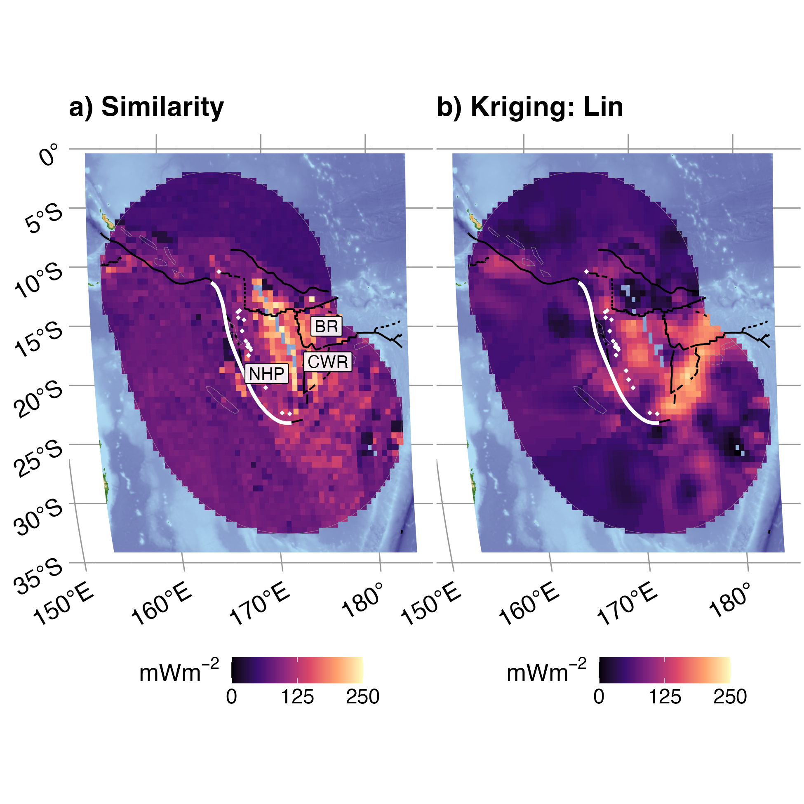

***Figure:*** *Global heat flow data compared to (a) Similarity (b) and Kriging (c) interpolations for near Japan. Volcanoes (white triangles) defined by Syracuse & Abers ([2006](https://agupubs.onlinelibrary.wiley.com/doi/abs/10.1029/2005gc001045)). Global heat flow data from the International Heat Flow Commission 2024 release (Global Heat Flow Data Assessment Group, [2024](https://doi.org/10.5880/fidgeo.2024.014)). Similarity interpolation from Lucazeau ([2019](https://agupubs.onlinelibrary.wiley.com/doi/full/10.1029/2019GC008389)). Plate boundaries (thick white lines) defined by Lawver et al. ([2018](https://repositories.lib.utexas.edu/handle/2152/65415)). Transect is from Submap Lallemand & Heuret ([2017](https://submap.gm.umontpellier.fr)).*

# Kerswell & Kohn (2024; in prep)

This work investigates the spatial continuity of surface heat flow near subduction zones. We compared two different interpolations methods, *Similarity* and *Kriging* to the 2024 release of the Global Heat Flow Database (Global Heat Flow Data Assessment Group, [2024](https://doi.org/10.5880/fidgeo.2024.014)). Interpolations show that surface heat flow is complex and often discontinuous along strike near subduction zones, thus implying that the deep thermal structure and/or near-surface modifications are also discontinuous.

## Repository

This repository provides all materials for the manuscript *A Comparison of Heat Flow Interpolations Near Subduction Zones* (Kerswell & Kohn 2024; in prep).

This repository includes:

- All datasets required to compile the study
- R scripts to reproduce all results and figures
- A Makefile to run the study
- A manuscript written in Rmarkdown

This repository is self-contained but requires the following software (all open-source).

## Prerequisite software

### R

This study is written in R. Follow the instructions at [R's homepage](https://www.r-project.org) to download and install the latest release of R on your machine.

### GDAL, GEOS, and PROJ

Geographic operations require the geographic libraries [gdal](https://gdal.org), [geos](https://trac.osgeo.org/geos), and [proj](https://proj.org). On a Mac, the easiest way to get gdal, geos, and proj is to use Homebrew. Follow the instructions at [Hombrew's homepage](https://brew.sh) to download and install Homebrew on your machine.

Once Homebrew is installed, the following will install the latest gdal, geos, and proj libraries together:

```
brew install pkg-config
brew install gdal
```

### sf

The trickiest R package to install is [sf](https://r-spatial.github.io/sf/), since it needs to be compiled from source and depends on gdal, geos, and proj. Installation instructions for mac are found [here](https://github.com/r-spatial/sf/issues/1536#issuecomment-727342736). For all other systems please see [sf's webpage](https://r-spatial.github.io/sf/).

## Running the study

```
# Clone this repository
git clone https://github.com/buchanankerswell/kerswell_kohn_backarc.git

# Change into the directory
cd kerswell_kohn_backarc

# Use Makefile to compile
make
```

This will check for required R packages and try to install missing packages automatically.

If all packages are found and available it will proceed to run the study with some initial prompts from the user. The study takes 10+ hours to run on my MacBook Pro (M2 16GB, 2022) with 8 cores computing in parallel.

## Coauthors

 - [Matthew Kohn](https://www.google.com/url?sa=t&rct=j&q=&esrc=s&source=web&cd=&cad=rja&uact=8&ved=2ahUKEwj8yqqTw8T5AhWSADQIHaYXAfQQFnoECA4QAQ&url=https%3A%2F%2Fwww.boisestate.edu%2Fearth%2Fstaff-members%2Fmatthew-j-kohn%2F&usg=AOvVaw3-lM9gvqmVRHG-WhSRFOdu) (Boise State University)

## Acknowledgement

We thank the Global Heat Flow Data Assessment Group for their tremendous efforts assessing the Global Heat Flow Database and providing it as open-access. We also thank the authors who freely provided other geospatial datasets, including volcanoes (Syracuse & Abers, 2006), plate boundaries (Lawver et al., 2018), interpolations (Lucazeau, 2019), and transects (Lallemand & Heuret, 2017). This work was supported by the National Science Foundation grant OISE 1545903 to M. Kohn, S. Penniston-Dorland, and M. Feineman.

## Open Research

All data, code, and relevant information for reproducing this work can be found at [https://github.com/buchanankerswell/kerswell_et_al_backarc](https://github.com/buchanankerswell/kerswell_et_al_backarc), and at [https://doi.org/10.17605/OSF.IO/CA6ZU](https://doi.org/10.17605/OSF.IO/CA6ZU), the official Open Science Framework data repository ([Kerswell et al., 2023](https://doi.org/10.17605/OSF.IO/CA6ZU)). All code is MIT Licensed and free for use and distribution (see license details).

## Abstract

The magnitude and spatial extent of heat fluxing through the Earth's surface depend on the integrated thermal state of Earth's lithosphere (conductive heat loss) plus heat generation (e.g. from seismic cycles and radioactive decay) and heat transfer via advection (e.g. by fluids, melts, and plate motions). Surface heat flow observations are thus critically important for understanding the thermo-mechanical evolution of subduction zones. Yet evaluating regional surface heat flow patterns across tectonic features remains difficult due to sparse observations irregularly-spaced at distances from 10$^`{-1}`$ to 10$`^3`$ km. Simple sampling methods (e.g. 1D trench-perpendicular transects across subduction zones) can provide excellent location-specific information but are insufficient for evaluating lateral (along-strike) variability. Robust interpolation methods are therefore required. This study compares two interpolation methods based on fundamentally different principles, *Similarity* and *Kriging*, to (1) investigate the spatial variability of surface heat flow near 13 presently active subduction zone segments and (2) provide insights into the reliability of such methods for subduction zone research. Similarity and Kriging predictions show diverse surface heat flow distributions and profiles among subduction zone segments and broad systematic changes along strike. Median upper-plate surface heat flow varies 25.4 mW/m$`^2`$ for Similarity and 40 mW/m$`^2`$ for Kriging within segments, on average, and up to 40.7 mW/m$`^2`$ for Similarity and up to 85.7 mW/m$`^2`$ for Kriging among segments. Diverse distributions and profiles within and among subduction zone segments imply spatial heterogeneities in lithospheric thickness, subsurface geodynamics, or near-surface perturbations, and/or undersampling relative to the scale and magnitude of spatial variability. Average accuracy rates of Similarity (28.8 mW/m$`^2`$) and Kriging (29.6 mW/m$`^2`$) predictions are comparable among subduction zone segments, implying either method is viable for subduction zone research. Importantly, anomalies and methodological idiosyncrasies identified by comparing Similarity and Kriging can aid in developing more accurate regional surface heat flow interpolations and identifying future survey targets.

# License

MIT License

Copyright (c) 2021 Buchanan Kerswell

Permission is hereby granted, free of charge, to any person obtaining a copy
of this software and associated documentation files (the "Software"), to deal
in the Software without restriction, including without limitation the rights
to use, copy, modify, merge, publish, distribute, sublicense, and/or sell
copies of the Software, and to permit persons to whom the Software is
furnished to do so, subject to the following conditions:

The above copyright notice and this permission notice shall be included in all
copies or substantial portions of the Software.

THE SOFTWARE IS PROVIDED "AS IS", WITHOUT WARRANTY OF ANY KIND, EXPRESS OR
IMPLIED, INCLUDING BUT NOT LIMITED TO THE WARRANTIES OF MERCHANTABILITY,
FITNESS FOR A PARTICULAR PURPOSE AND NONINFRINGEMENT. IN NO EVENT SHALL THE
AUTHORS OR COPYRIGHT HOLDERS BE LIABLE FOR ANY CLAIM, DAMAGES OR OTHER
LIABILITY, WHETHER IN AN ACTION OF CONTRACT, TORT OR OTHERWISE, ARISING FROM,
OUT OF OR IN CONNECTION WITH THE SOFTWARE OR THE USE OR OTHER DEALINGS IN THE
SOFTWARE.
